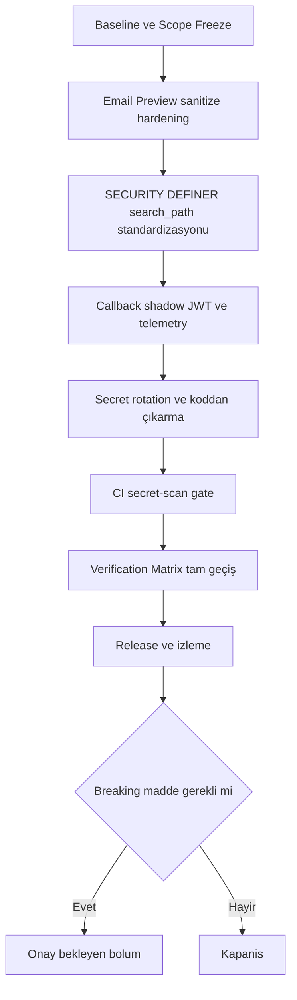

# Güvenlik Bulgularını Kapatma Uygulama Planı

## Amaç ve Kapsam

Bu doküman, konsolide güvenlik bulgularını düşük riskli ve kırıcı olmayan bir sırayla kapatmak için uygulanacak teknik planı tanımlar.

Karar kaydı:
- Öncelik yalnızca non-breaking düzeltmelerdedir.
- Kırıcı maddeler ayrı bir onay kapısına alınır.
- Bu doküman, kırıcı maddeler için onay öncesi referans plan olarak kullanılır.

Kapsamdaki bulgular:
1. Uygulama katmanında e-posta preview sanitize yaklaşımında residual XSS riski.
2. Supabase tarafında SECURITY DEFINER fonksiyonlarda search_path standardizasyon boşlukları.
3. Supabase callback yüzeyinde JWT doğrulama ve telemetri sertleştirme ihtiyacı.
4. Secret-scan high bulgusu: supabase/functions/sync-auth-templates/index.ts.
5. Kırıcı olabilecek maddeler: site_settings public read policy daraltma, callback kimlik doğrulamasını zorunlu sertleştirme, iframe sandbox davranış değişimi.

Kapsam dışı:
- Bu aşamada kırıcı davranış değişikliği yok.
- Bu aşamada ek refactor ve fonksiyonel ürün geliştirmesi yok.
- Bu görevde kod veya migration uygulanmaz; sadece uygulama planı üretilir.

---

## Non-Breaking Remediation Plan (adım adım)

### Faz 0 - Baseline ve Scope Freeze
1. Kapsamı bu dokümandaki bulgularla sabitle.
2. Mevcut risk durumunu baseline artefactlarla kaydet.
3. Değişiklikleri küçük, geri alınabilir paketlere böl.

Çıktı:
- Faz bazlı değişiklik listesi
- Onay gerektiren ve gerektirmeyen maddelerin net ayrımı

### Faz 1 - Email Preview XSS Riskini Non-Breaking Sertleştirme
1. Regex tabanlı sanitize akışını, allowlist tabanlı ve deterministik sanitize pipeline ile değiştirecek tasarımı uygula.
2. Event handler attribute, javascript URL, inline script benzeri içerikleri normalize et ve engelle.
3. Preview render davranışını koru, kullanıcı iş akışını kıracak UI değişikliği yapma.
4. Negatif payload seti ile güvenlik regresyon testleri tanımla.

Kabul kriteri:
- Preview fonksiyonu çalışmaya devam eder.
- Bilinen XSS payload sınıfları sanitize edilir veya güvenli fallbacke düşer.

### Faz 2 - Supabase SECURITY DEFINER search_path Standardizasyonu
1. SECURITY DEFINER fonksiyon envanterini çıkar.
2. Eksik fonksiyonlarda search_path standardını tek kalıba çek.
3. Standardı migration ile tekrarlanabilir hale getir.
4. Sonuçları advisor ve drift kontrolleriyle doğrula.

Kabul kriteri:
- SECURITY DEFINER fonksiyonlarda mutable search_path bulgusu kapanır.
- Migration sonrası drift oluşmaz.

### Faz 3 - Callback JWT ve Telemetry Hardeningi Non-Breaking Modda Uygulama
1. Callback uçlarında şema doğrulama ve redaction kurallarını netleştir.
2. JWT doğrulamasını zorunlu bloklayıcı moda almadan, shadow doğrulama ve telemetri toplama modunda başlat.
3. Korelasyon kimliği, hata sınıflaması ve güvenlik olay loglarını standardize et.
4. Yanıt sözleşmesini bozmayacak şekilde observability alanlarını genişlet.

Kabul kriteri:
- Mevcut callback entegrasyonları kırılmaz.
- Yetki ve token anomalileri ölçülebilir hale gelir.

### Faz 4 - Secret-Scan High Bulgusunu Kapatma
1. Etkilenen secretları derhal döndür ve eski değerleri iptal et.
2. Secret materyalini kaynak kodundan çıkar, yalnızca güvenli secret store üzerinden eriş.
3. sync-auth-templates akışında secret eksikliği için fail-safe ve redacted hata davranışını zorunlu hale getir.
4. Geçmiş ve mevcut taramada high bulgu kalmadığını doğrula.

Kabul kriteri:
- Kaynak kodda hardcoded secret kalmaz.
- Döndürülen secretlar dışında aktif secret bulunmaz.

### Faz 5 - CI Secret-Scan Gate ve Operasyonel Kapanış
1. CI güvenlik kapısına zorunlu secret-scan adımı ekle.
2. False positive yönetimi için açık istisna süreci tanımla.
3. Pull request akışında high severity secret bulgusunda merge blok kuralını uygula.
4. Mevcut security gate zinciriyle birlikte tam doğrulama çalıştır.

Kabul kriteri:
- Secret-scan adımı CI içinde zorunlu ve geçiş kriterine bağlıdır.
- Yeni secret sızıntıları merge öncesi yakalanır.

---

## Verification Matrix

Aşağıdaki matris her faz sonunda ve final kapanışta çalıştırılır.

| Kontrol | Komut veya Pipeline | Amaç | Geçiş Kriteri | Kanıt |
| --- | --- | --- | --- | --- |
| Lint | npm run lint | Statik kalite ve temel güvenlik hijyeni | Hata yok | lint çıktısı artefact |
| Build | npm run build | Derlenebilirlik ve paket bütünlüğü | Build başarıyla tamamlanır | build log artefact |
| Audit | npm audit --audit-level=high | High seviye bağımlılık açığı kontrolü | High bulgu yok | audit raporu |
| Security Gate Local | npm run security:gate | Audit + lint + build + migration list zincir doğrulaması | Tüm adımlar başarılı | security gate log |
| Security Gate CI | .github/workflows/security-gate.yml | Merkezi kalite kapısı doğrulaması | Workflow başarılı | CI run linki ve log |
| Drift Check | npx supabase db diff --linked --use-migra --schema public | Remote ve migration uyumu | drift.sql boş veya sadece yorum | drift.sql ve drift.err |

Ek doğrulamalar:
- Secret scan çıktısı high severity içermemeli.
- Callback shadow telemetri metriklerinde anomali alarm eşikleri gözlenebilir olmalı.

---

## Breaking Changes Requiring Approval

Durum: Onay Bekliyor

### 1) site_settings Public Read Policy Daraltma
Neden breaking:
- Public okuma davranışına bağımlı istemci ekranları etkilenebilir.

Onay sonrası uygulanacak yaklaşım:
- Etki analizi ve tüketici envanteri
- Kademeli daraltma ve fallback planı
- UAT tamamlanmadan productiona tam geçiş yapılmaması

### 2) Callback Kimlik Doğrulamasını Zorunlu Sertleştirme
Neden breaking:
- JWT zorunluluğu, mevcut token üretmeyen çağrıları anında reddedebilir.

Onay sonrası uygulanacak yaklaşım:
- Shadow mod metriklerine göre kesme eşiği belirleme
- Önce canary, sonra tam enforcement
- İstemci entegrasyon checklisti tamamlanmadan zorunlu moda geçmeme

### 3) Iframe Sandbox Davranış Değişimi
Neden breaking:
- Preview ve gömülü içerik davranışı fonksiyonel farklılık gösterebilir.

Onay sonrası uygulanacak yaklaşım:
- Etkilenen senaryoların taranması
- Sandbox izinlerinin en dar yetki ile yeniden tanımlanması
- UI regression testlerinden sonra aşamalı yayın

---

## Rollback / Risk Mitigation

Genel strateji:
1. Her faz tek sorumluluklu ve geri alınabilir değişiklik paketi olarak ilerletilir.
2. Faz geçişi, Verification Matrix tam geçmeden yapılmaz.
3. Gözlemlenebilirlik verisi zayıfsa enforcement adımı ertelenir.

Faz bazlı geri dönüş yaklaşımı:
- Faz 1: Önceki sanitize akışına feature flag ile kontrollü dönüş.
- Faz 2: search_path standardizasyon migrationı için ters migration hazır tutulur.
- Faz 3: Callback hardening shadow modda kalır; bloklayıcı davranış aktive edilmez.
- Faz 4: Secret rotasyonda çift anahtar geçiş penceresi uygulanır, eski anahtarlar kontrollü iptal edilir.
- Faz 5: CI secret-scan false positive durumunda kayıtlı istisna süreci işletilir, kalıcı bypass uygulanmaz.

Operasyonel risk azaltma:
- Küçük PR stratejisi
- Faz sonu gate raporu
- Üretim öncesi dry-run ve canary
- Olay durumunda hızlı rollback runbooku
