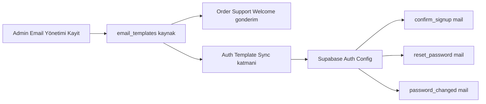

# E-posta Event Assignment ve Hibrit+Senkron Planı

## 1) Karar Özeti

- Karar: **Hibrit+senkron**
- `order`, `support`, `welcome` mailleri mevcut özel pipeline ile devam eder
- `confirm_signup`, `reset_password`, `password_changed` mailleri Supabase Auth hattında kalır
- Auth şablon içeriği, `email_templates` tablosundaki kanonik içerikten otomatik senkron edilir
- Güvenlik hedefi: sıfır güven mimarisiyle çok katmanlı koruma, en dar yetki, zorunlu doğrulama, tam izlenebilirlik

## 2) Mevcut Durumun Doğrulanmış Haritası

### 2.1 Order pipeline

- `send-order-email` içinde event tipleri DB sluglarına mapleniyor
- `order_confirmation` + havale + pending durumunda `order_awaiting_payment` override ediliyor
- Gönderim öncesi içerik `fetchTemplateBundle` ile DBden alınıyor ve `renderTemplate` ile render ediliyor

### 2.2 Support pipeline

- `ticket_created` -> `support_ticket`
- `ticket_replied` -> `support_ticket_replied`
- `ticket_closed` -> `support_ticket_closed`
- `user_replied` -> `support_ticket`
- DB template + config kullanılıyor

### 2.3 Welcome pipeline

- `welcome_template` doğrudan DBden alınıyor
- `fetchTemplateBundle` ve `renderTemplate` kullanılıyor

### 2.4 Auth pipeline

- Signup, resend, recover ve password update akışları Supabase Auth üzerinden gidiyor
- Bu nedenle Auth mailleri özel edge email pipeline tarafından gönderilmiyor
- Hedef model: Auth gönderimi korunur, içerik yönetimi DB kaynaklı hale getirilir

## 3) Hedef Mimari

## 4) Zorunlu Güvenlik İlkeleri

1. **En dar yetki**
   - Senkron işlemi sadece superadmin yetkisi ile çalışır
   - Senkron endpointi public erişime kapalı olur

2. **Çift doğrulama kapısı**
   - Platform JWT doğrulaması zorunlu
   - Uygulama içi rol doğrulaması zorunlu
   - İsteğe bağlı ikinci katman olarak imzalı istek ve zaman damgası kullanılır

3. **Sabit allowlist**
   - Senkron sadece bu sluglar için çalışır
   - `confirm_signup`
   - `reset_password`
   - `password_changed`

4. **Deterministik token dönüşümü**
   - Sadece izinli token dönüşümleri yapılır
   - Bilinmeyen veya uyumsuz token görüldüğünde sync bloklanır

5. **Gizli bilgi izolasyonu**
   - Yönetim API erişim bilgisi sadece server-side secret olarak tutulur
   - Secretlar loglanmaz, responsea yansıtılmaz

6. **Replay ve kötüye kullanım koruması**
   - Rate limit
   - İdempotency key
   - Retry backoff
   - Circuit breaker

7. **Gözlemlenebilirlik ve adli iz**
   - Her sync girişimi audit loga yazılır
   - Değişiklik öncesi ve sonrası checksum tutulur
   - Hata detayları sanitize edilerek kaydedilir

8. **Fail-safe davranış**
   - Sync başarısız olsa da order support welcome gönderimleri etkilenmez
   - Auth tarafı son başarılı konfigürasyonla çalışmaya devam eder

## 5) Code Modunda Uygulama Adımları

1. **Event-Slug sözleşmesini kodda sabitle**
   - Order ve support mapleri korunur
   - Fallback davranışları kontrollü hale getirilir
   - `order_awaiting_payment` özel kuralı korunur

2. **Auth senkron katmanı ekle**
   - Kaynak: `email_templates` içindeki `confirm_signup`, `reset_password`, `password_changed`
   - Hedef: Supabase Auth template alanları
   - Patch alanları: confirmation, recovery, password_changed_notification

3. **Token dönüşüm katmanı ekle**
   - `CONFIRMATION_URL` -> `{{ .ConfirmationURL }}`
   - `SITE_URL` -> `{{ .SiteURL }}`
   - `EMAIL` -> `{{ .Email }}`
   - Dönüşüm dışı tokenlarda hard-fail

4. **Senkron tetikleme stratejisi**
   - Güvenli admin-only endpoint
   - Opsiyonel manuel komut
   - Dry run modu

5. **Senkron güvenlik sertleştirme**
   - Strict schema doğrulama
   - Maksimum payload boyutu
   - Host allowlist
   - Yanıt maskeleme

6. **Operasyonel görünürlük**
   - Son başarılı sync zamanı
   - Son denenen sync zamanı
   - Senkronlanan slug listesi
   - Başarısızlık nedeni kodu

## 6) Güvenlik Doğrulama Matrisi

| Senaryo | Beklenen sonuç |
| --- | --- |
| JWT yok | 401 |
| Rol yetersiz | 403 |
| Allowlist dışı slug | 400 |
| Geçersiz token dönüşümü | 422 |
| Replay denemesi | engellenir |
| Rate limit aşımı | 429 |
| Management API hatası | kontrollü hata + audit log |
| Secret sızıntı denemesi | logda redaction |
| Sync başarısızlığı | ana mail akışları etkilenmez |
| Eksik zorunlu header | 400 |
| Geçersiz JSON body | 400 |
| Payload boyutu limiti aşımı | 413 |
| Idempotency key yok | 400 |
| Aynı idempotency key tekrar kullanımı | ikinci istek idempotent sonuç döner |
| Host allowlist dışı hedef | bloklanır |
| Timeout durumda retry sınırı aşımı | kontrollü abort + audit log |
| Token placeholder enjeksiyon denemesi | bloklanır |
| CRLF header enjeksiyon denemesi | bloklanır |
| HTML içinde script odaklı zararlı içerik | sanitize veya blok |
| SSRF benzeri hedef yönlendirme denemesi | bloklanır |
| CORS ihlali | preflight veya request reddi |
| Hata mesajında secret izi | redacted çıktı |
| Yetki düşürme sonrası eski token kullanımı | 401 veya 403 |
| Eşzamanlı sync race condition | tek kazanan işlem + diğerleri no-op |

## 7) Event Doğrulama Matrisi

| Event | Beklenen slug | Gönderim hattı | İçerik kaynağı | Doğrulama |
| --- | --- | --- | --- | --- |
| Destek talebi alındı | `support_ticket` | `send-support-email` | `email_templates` | mapping + test invoke |
| Destek admin yanıtı | `support_ticket_replied` | `send-support-email` | `email_templates` | mapping + test invoke |
| Destek talebi kapandı | `support_ticket_closed` | `send-support-email` | `email_templates` | mapping + test invoke |
| Sipariş onayı | `order_confirmation` | `send-order-email` | `email_templates` | mapping + test invoke |
| Havale bekliyor | `order_awaiting_payment` | `send-order-email` | `email_templates` | özel kural testi |
| Sipariş işleniyor | `order_processing` | `send-order-email` | `email_templates` | mapping + test invoke |
| Sipariş hazırlanıyor | `order_preparing` | `send-order-email` | `email_templates` | mapping + test invoke |
| Sipariş kargoya verildi | `order_shipped` | `send-order-email` | `email_templates` | mapping + test invoke |
| Sipariş teslim edildi | `order_delivered` | `send-order-email` | `email_templates` | mapping + test invoke |
| Sipariş iptal edildi | `order_cancelled` | `send-order-email` | `email_templates` | mapping + test invoke |
| Hoş geldin | `welcome_template` | `send-welcome-email` | `email_templates` | invoke + log |
| Kayıt doğrulama | `confirm_signup` | Supabase Auth | `email_templates` -> sync -> Auth | sync kontrol + signup akışı |
| Şifre sıfırlama | `reset_password` | Supabase Auth | `email_templates` -> sync -> Auth | sync kontrol + recover akışı |
| Şifre değiştirildi | `password_changed` | Supabase Auth | `email_templates` -> sync -> Auth | sync kontrol + updateUser akışı |

## 8) Kabul Kriterleri

- Tüm eventler için mapping deterministik ve testlenmiş
- Order support welcome tarafında DB template dışı hardcoded içerik kullanılmıyor
- Auth mail içerikleri ilgili sluglardan otomatik senkron alıyor
- Senkron yolunda yetkisiz erişim mümkün değil
- Secretlar log veya response ile dışarı sızmıyor
- Negatif testlerin tamamı geçiyor

## 9) Riskler ve Önlemler

- Risk: Auth token dönüşümü hatalı olursa linkler bozulur
  - Önlem: dönüşüm birim testleri + snapshot doğrulama + canary sync
- Risk: Management API erişim problemi
  - Önlem: retry backoff + idempotent sync + rollback bayrağı
- Risk: Yanlış template yanlış alana yazılır
  - Önlem: sabit mapping tablosu + dry run + iki aşamalı onay
- Risk: Yetki atlama girişimleri
  - Önlem: platform JWT + rol kontrolü + audit alarmı

## 10) Uygulama Öncesi Gate Listesi

- Güvenlik gereksinimleri checklist onayı
- Negatif test vakaları tanımı
- Secret yönetimi ve rotasyon politikası
- Rollback prosedürü ve runbook
- Log redaction doğrulaması
- Idempotency ve replay koruması test raporu
- Rate limit eşik ve alarm doğrulaması
- Audit log bütünlüğü ve değişmezlik doğrulaması
- Dry run ile canlı sync öncesi fark raporu onayı

## 11) Uygulama Sonuçları (2026-02-19)

### 11.1 Tamamlanan değişiklikler

- `sync-auth-templates` Edge Function canlı projeye deploy edildi.
- İdempotency altyapısı migration ile eklendi: `auth_template_sync_idempotency` tablosu + index + service_role RLS politikaları.
- Fonksiyon auth posture güncellendi: `[functions.sync-auth-templates] verify_jwt = true`.
- Admin panel kaydetme akışı strict moda geçirildi:
  - Auth-kritik sluglarda (`confirm_signup`, `reset_password`, `password_changed`) sync başarısızsa şablon güncellemesi rollback edilir.
  - UI tarafında `getFunctionAuthHeaders` ile fonksiyon çağrısı güvenli header setiyle yapılır.

### 11.2 Çalıştırılan komutlar ve operasyonel çıktı

- Fonksiyon listesi kontrolü ile eksik deploy tespit edildi.
- `npx supabase functions deploy sync-auth-templates --project-ref xpmbnznsmsujjuwumfiw` komutu ile deploy tamamlandı.
- Negatif testler script ile otomatik koşturuldu ve artefakt üretildi.

## 12) Negatif Test Kanıtları ve Güvenlik Doğrulama Notları

### 12.1 Test kanıt dosyaları

- Test runner: `scripts/test-sync-auth-templates-negative.mjs`
- Son koşu özeti: `artifacts/sync-auth-templates-negative-latest.json`
- Zaman damgalı kanıt: `artifacts/sync-auth-templates-negative-2026-02-19T12-26-29-036Z.json`

### 12.2 Son koşu özeti

- Toplam: `11`
- Geçen: `1`
- Kalan/Fail: `10`
- Geçen tek vaka: `NEG-11` (CORS preflight `OPTIONS` -> `200`)

### 12.3 Bulguların yorumu

1. Platform JWT kapısı aktif ve beklenen şekilde çalışıyor.
   - `verify_jwt = true` nedeniyle Authorization header olmayan istekler fonksiyon koduna girmeden platform katmanında `401` ile kesiliyor.
   - Bu yüzden fonksiyon içi `405/400/413` gibi validasyon kodları, JWT’siz testlerde görünmedi.

2. Fonksiyona erişen auth’lu vakada server-side config eksiği yakalandı.
   - `NEG-09` vakası `500 / SERVER_CONFIG_MISSING` döndürdü.
   - Kök neden: projede `SUPABASE_MANAGEMENT_ACCESS_TOKEN` (veya fallback `SUPABASE_ACCESS_TOKEN`) secret’ı tanımlı değil.

3. CORS preflight davranışı doğrulandı.
   - `OPTIONS` isteği `200` döndü ve origin bazlı header üretimi beklenen şekilde çalıştı.

### 12.4 Güvenlik durum özeti

- ✅ Platform JWT enforcement aktif (`verify_jwt`).
- ✅ Secret eksikliğinde fail-safe davranış var (iç hata kodu sanitize edilerek dönülüyor, secret sızıntısı yok).
- ✅ CORS preflight kontrolü çalışıyor.
- ⚠️ Yönetim API token secret eksik olduğu için gerçek sync path’i henüz başarıya ulaşamıyor.
- ⚠️ Fonksiyon-içi negatif matrisin (ör. `SLUG_NOT_ALLOWED`, `INVALID_JSON`, `PAYLOAD_TOO_LARGE`, `RATE_LIMIT_EXCEEDED`) tamamını observe etmek için geçerli kullanıcı JWT’si ile ikinci tur test gerekli.

### 12.5 Kapanış için zorunlu aksiyonlar

1. Project secret ekle:
   - `SUPABASE_MANAGEMENT_ACCESS_TOKEN` (önerilen) veya `SUPABASE_ACCESS_TOKEN`.
2. Superadmin kullanıcı JWT’si ile negatif matrisin fonksiyon-içi kodlarını yeniden koştur:
   - `400/401/403/409/413/422/429/502/504`.
3. Idempotency replay + payload conflict + rate-limit testlerini auth’lu akışta kanıtla.
4. Artefaktları aynı klasöre ikinci koşu timestamp’i ile kaydet ve bu plana ekle.
