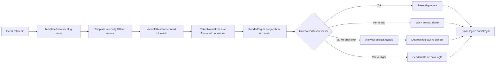

# E-posta Şablon Birleştirme Mimarisi Planı

## 1. Kararlaştırılmış Ürün Kuralları

- Kanonik token formatı: `{{VARIABLE_KEY}}`
- Sürükle bırak kapsamı: sadece editörde değişken sıralama ve ekleme
- Test gönderimi: çözülmeyen tokenlar uyarı üretir, gönderimi zorunlu olarak bloklamaz
- Gerçek gönderim:
  - Auth kritik olmayan şablonlarda çözülmeyen token varsa blok
  - Auth kritik şablonlarda strict allowlist fallback uygulanır, akış kesilmez, degrade log yazılır

## 2. Mevcut Durumdan Kaynaklı Temel Sorunlar

- Değişken render mantığı edge functionlarda dağınık ve tekrarlı
- Token formatları karışık
  - `{{KEY}}`
  - `{{ KEY }}`
  - `{{.Key}}`
  - `{{ .ConfirmationURL }}`
  - `{{UnsubscribeURL}}`
- Admin editörü ham HTML odaklı, ortak global değişken kataloğu ve sürükle bırak düzeni yok
- `email_templates.variables` alanı var ama global katalog olarak tasarlanmamış

## 3. Hedef Mimari

Tek bir ortak render katmanı tasarlanır ve tüm göndericiler bu katmanı kullanır. Edge functionlar sadece domain verisini üretir, render ve validasyon ortak modülde yapılır.



## 4. Ortak Render Sözleşmesi

Önerilen ortak arayüz

```ts
renderTemplate({
  templateSlug,
  mode,
  locale,
  context,
  requestMeta
}) => {
  subject: string,
  html: string,
  text: string,
  unresolvedTokens: string[],
  warnings: string[],
  usedVariables: string[],
  blocked: boolean,
  degradation: {
    active: boolean,
    reason: string | null
  }
}
```

### Mod davranışı

- `mode = test`
  - unresolved tokenlar `warnings` içine yazılır
  - çıktı üretilir, admin ekrana ayrıntı döner
- `mode = send`
  - auth kritik olmayan şablon: unresolved varsa `blocked = true`
  - auth kritik şablon: allowlist fallback uygulanır, kalan unresolved tokenlar güvenli boş değerle degrade edilir ve zorunlu audit log yazılır
- `mode = browser_preview`
  - simülasyon örnek verileri ile deterministik önizleme

## 5. Veri Modeli Evrimi

Mevcut tablo korunur: `email_templates`.

### 5.1 Yeni tablo: `email_variable_registry`

Amaç: tüm şablonlarda ortak kullanılabilecek global değişken kataloğu.

Önerilen alanlar

- `key` text primary key, format kontrolü `^[A-Z0-9_]+$`
- `label` text
- `description` text
- `value_type` text
- `render_policy` text
  - `escaped_text`
  - `raw_html`
  - `url`
- `sample_value` text
- `is_sensitive` boolean
- `is_active` boolean
- `created_at`, `updated_at`

### 5.2 Yeni tablo: `email_template_variables`

Amaç: template bazında hangi değişkenin kullanılacağı, zorunluluk ve editör sırası.

Önerilen alanlar

- `id` uuid
- `template_slug` text fk to `email_templates.slug`
- `variable_key` text fk to `email_variable_registry.key`
- `is_required` boolean
- `insertion_order` int
- `is_enabled` boolean
- `created_at`, `updated_at`
- unique: `template_slug + variable_key`

### 5.3 `email_templates` için ek alanlar

- `is_auth_critical` boolean default false
- `unresolved_policy` text default `block`
- `allowlist_fallback_keys` text[] default empty
- `normalization_version` int default 1
- `editor_schema` jsonb default empty object

### 5.4 Geriye uyumluluk

- `variables JSONB` alanı ilk aşamada tutulur
- geçiş boyunca yeni tabloya backfill yapılır
- cutover sonrası `variables JSONB` sadece legacy read için bırakılır, yeni yazım kapatılır

## 6. Token Normalizasyon Stratejisi

Render öncesi tokenlar normalize edilir ve tek kanonik formata çevrilir.

### Desteklenecek legacy kalıplar

- `{{ KEY }}` -> `{{KEY}}`
- `{{.Key}}` -> map ile `{{KEY}}`
- `{{ .ConfirmationURL }}` -> `{{CONFIRMATION_URL}}`
- `{{UnsubscribeURL}}` -> `{{UNSUBSCRIBE_URL}}`

### Anahtar dönüşüm kuralları

- CamelCase -> UPPER_SNAKE_CASE
- Nokta öneki temizleme
- Boşluk temizleme

### Güvenli geçiş

- Normalizasyon çıktısı migration raporuna yazılır
- Çözülemeyen dönüşümler manuel onay kuyruğuna düşer

## 7. Güvenlik ve Doğrulama Kuralları

- Subject alanına sadece `escaped_text` ve `url` policy izinli
- HTML gövdede `raw_html` sadece açık izinli değişkenlerde geçerli
- URL policy için protokol doğrulaması zorunlu
- Render sonucu `unresolvedTokens` her zaman raporlanır
- Gerçek gönderim blok durumları `email_logs` ve audit tablosuna yazılır
- Auth kritik degrade gönderimlerde ayrıca güvenlik seviyesi yüksek log kaydı atılır

## 8. Admin Editör UX Tasarımı

Mevcut editör korunur, üzerine modüler ek yapılır.

### Yeni bileşenler

- Global değişken paleti
  - kategori bazlı liste
  - arama
  - tıkla ekle ve sürükle bırak desteği
- Template değişken panosu
  - sıralanabilir chip listesi
  - zorunlu değişken işareti
- Token ekleme davranışı
  - cursor pozisyonuna `{{VARIABLE_KEY}}` ekleme
  - subject ve html için ortak ekleme komutu
- Deterministik önizleme
  - `sample_value` bazlı örnek veri
  - unresolved tokenlar için panelde uyarı listesi

## 9. Edge Function Sahiplik Sınırları

- `send-order-email`, `send-support-email`, `send-welcome-email`, `send-test-email`
  - sadece domain context üretir
  - render, normalizasyon, unresolved kontrolü ortak modülden gelir
- Böylece her function içinde ayrı ayrı `replaceAll` döngüsü kaldırılır
- Şablon sahipliği DB ve ortak renderer tarafında tekilleştirilir

## 10. Geçiş ve Backfill Planı

1. Yeni tablolar ve alanlar migration ile eklenir
2. Registry başlangıç seedleri yazılır
3. Template içeriği taranır, token envanteri çıkarılır
4. Legacy tokenlar normalize edilip kanonik forma çevrilir
5. `email_template_variables` backfill edilir
6. Ortak renderer devreye alınır
7. Fonksiyonlar tek tek ortak renderer kullanımına geçirilir
8. Test gönderim uyarı çıktıları admin arayüzüne bağlanır
9. Gerçek gönderim blok ve auth fallback politikası aktive edilir
10. Legacy `variables JSONB` write-path kapatılır

## 11. Doğrulama Matrisi

- Birim testler
  - token parse ve normalize
  - unresolved algılama
  - fallback davranışı
- Entegrasyon testleri
  - tüm edge functionlar ortak renderer kullanıyor doğrulaması
  - auth kritik şablon degrade gönderim logu doğrulaması
- UI testleri
  - sürükle bırak sıralama kalıcılığı
  - token ekleme doğruluğu
  - preview uyarı paneli
- Güvenlik testleri
  - subject escape
  - html raw whitelist
  - url policy

## 12. Code Modu İçin Uygulama Backlogu

- Migration paketi
  - yeni tablolar
  - yeni kolonlar
  - index ve constraintler
- Shared renderer modülü
  - parse normalize render validate pipeline
- Edge function refactor
  - mevcut replaceAll akışlarını kaldırma
  - ortak sözleşmeye geçiş
- Admin UI refactor
  - variable registry yönetimi
  - drag drop variable board
  - unresolved warning panel
- Test katmanı
  - unit integration ui security senaryoları
- Rollout kontrol listesi
  - fonksiyon bazlı canlı doğrulama
  - log kalite kontrolü

## 13. Riskler ve Önlemler

- Risk: yanlış normalizasyon nedeniyle canlı şablon bozulması
  - Önlem: migration raporu ve manuel onay kuyruğu
- Risk: auth mail akışının kırılması
  - Önlem: strict allowlist fallback ve degrade audit
- Risk: farklı fonksiyonlarda gizli davranış farkı
  - Önlem: shared renderer zorunluluğu ve entegrasyon testleri

## 14. Onay Sonrası Uygulama Prensibi

Bu plan onaylandığında kod tarafına geçişte ilk adım migration ve shared renderer çekirdeği olacaktır. Sonraki adım edge function refactor ve admin editör güncellemesidir.