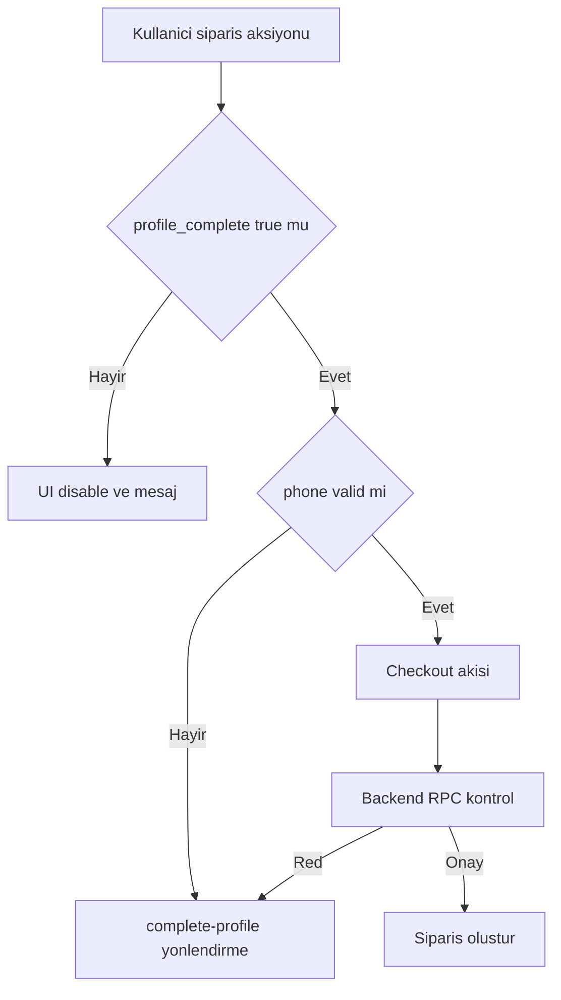

# Plan: Profile Tamamlanmadan Satın Alma / Sipariş Engeli

## 1) Hedef ve Kural
- Tek kural: `profile_complete = false` olan **tüm kullanıcılar** satın alma ve sipariş akışına giremez.
- Telefon şartı: şimdilik **format validasyonu zorunlu**, SMS/OTP zorunlu değil.

## 2) Etki Alanı Envanteri
- Global satın al CTA: `Header` içindeki `handleBuyClick`.
- Sepet -> checkout geçişi: `CartModal` içindeki `handleCheckout`.
- Checkout sipariş onayı: `Checkout` içindeki `handlePlaceOrder`.
- Profil boş sipariş ekranı CTA: `OrderHistory` içindeki `openCart` butonu.
- Checkout’a geri dönebilen yollar: `PaymentFailed` ve `ThreeDSRedirect` ekranları.

## 3) Mimari Yaklaşım
- Savunma katmanları:
  1. UI katmanı: buton disable + açıklayıcı tooltip/metin
  2. Route/flow katmanı: bypass denemesinde `/complete-profile` yönlendirmesi
  3. Backend katmanı: RPC/Edge Function sipariş denemesinde sert red

## 4) Frontend Planı
### 4.1 Tekil guard mantığı
- Ortak bir guard yardımcı yapısı eklenecek (örn. `src/lib/profileGate.ts`).
- Hesaplama girdileri: `isAuthenticated`, `user`, `isStub`, `profile_complete`, `phone`.
- Çıktılar:
  - `isPurchaseBlocked`
  - `blockReason` (`PROFILE_INCOMPLETE` veya `PHONE_REQUIRED`)

### 4.2 CTA disable ve yönlendirme
- `Header`: mevcut disable korunacak, neden mesajı standardize edilecek.
- `OrderHistory`: `openCart` CTA için disable + uyarı eklenecek.
- `CartModal`: mevcut `/complete-profile` yönlendirmesi korunacak, mesajlar standardize edilecek.
- `Checkout`: sayfa girişinde profile gate eklenecek; sipariş butonu disabled kuralına bağlanacak.
- `PaymentFailed` ve `ThreeDSRedirect`: checkout geri dönüşünde profile gate uygulanacak.

## 5) Complete Profile Planı
- `CompleteProfile` formuna `phone` alanı eklenecek.
- `react-phone-number-input` ile TR default, zorunlu alan, format doğrulama.
- `zod` şemasına telefon validasyonu eklenecek.
- Upsert sırasında `phone` yazılmadan `profile_complete=true` set edilmeyecek.

## 6) Google OAuth Akışı
- Google signup akışındaki boş telefon metadata kabul edilecek (ilk kayıt için).
- Ancak `CompleteProfile` tamamlanmadan ve telefon valid değilken `profile_complete=true` olamayacak.
- `AuthContext` içindeki profile sync akışlarında otomatik tamamlanma davranışı sıkılaştırılacak.

## 7) Backend Planı
### 7.1 Mevcut kontrolü koru/genişlet
- `validate_checkout` içindeki `PROFILE_INCOMPLETE` kontrolü korunacak.
- Ek olarak telefon yok/geçersizse `PHONE_REQUIRED` dönülecek.

### 7.2 Kart ödeme RPC’lerinde sert kontrol
- `calculate_order_quote_v1` içine profil + telefon kontrolü eklenecek.
- `finalize_intent_create_order_v1` içine aynı kontrol tekrar eklenecek.
- Böylece init aşaması ve finalize aşaması ayrı ayrı korunmuş olacak.

### 7.3 Edge Function davranışı
- `bakiyem-init-3d` RPC hatalarını kayıpsız taşıyacak.
- Frontend bu hata kodlarına göre kullanıcıyı `/complete-profile` ekranına yönlendirecek.

## 8) Hata Sözleşmesi
- Standart backend kodları:
  - `PROFILE_INCOMPLETE`
  - `PHONE_REQUIRED`
- Frontend mapping:
  - i18n key tabanlı mesajlar
  - Checkout/Cart/CTA katmanlarında tutarlı toast + redirect davranışı

## 9) Doğrulama Matrisi
- Senaryolar:
  1. Email signup + profile incomplete
  2. Google signup + profile incomplete
  3. Eski kullanıcı + profile incomplete
  4. Complete profile + geçerli telefon
  5. Cart bypass denemesi
  6. Checkout direkt URL denemesi
  7. Bank transfer create_order
  8. Card payment init + finalize
- Beklenen: profile/phone şartı sağlanmadan sipariş hiçbir katmanda oluşmamalı.

## 10) Kalite Kapısı
- Uygulama sonrası `Security-gate.yml` kapsamı çalıştırılacak.
- Audit/build/lint bulguları kapatılacak.
- Debug amaçlı eklenen tüm `console` kayıtları temizlenecek.

## Mermaid Akış

